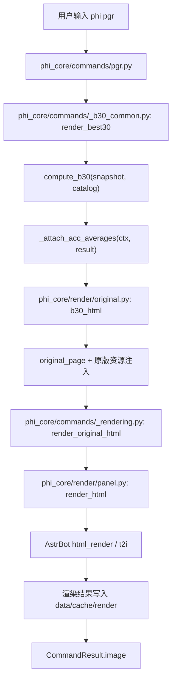

# PGR 渲染链路

本文记录 `phi pgr` 从命令输入到图片输出的完整链路，并说明其他查分图片命令如何复用同一套链路。

## 总流程

## 命令入口

`phi pgr` 的实际入口是：

- `phi_core/commands/pgr.py`
- `phi_core/commands/_b30_common.py`

流程如下：

1. `pgr.py` 把命令转发给 `render_best30(ctx, user_id)`。
2. `_b30_common.py` 从本地缓存读取 `snapshot`。
3. `compute_b30(snapshot, ctx.catalog)` 计算 B30 数据。
4. `_attach_acc_averages(...)` 请求曲目平均 ACC，并写回到记录对象。
5. 图片模式下调用 `render_original_html(ctx, original.b30_html(...), "b30")`。

## 原版 HTML 组装

`original.b30_html(...)` 位于：

- `phi_core/render/original.py`

它负责把数据组装成原版风格 HTML，主要依赖：

- `original_page(...)`
- `_b30_title(...)`
- `_b30_record_card(...)`
- `_b30_sp_info(...)`

`pgr` 使用 `html/b19/b19.css`，`x30/p30/best/fc30` 使用 `html/b19/dss2.css`，`update` 使用 `html/update/update.css`，`info` 使用 `html/userinfo/userinfo.css`。这些 CSS 与图片资源都来自 AstrBot 插件数据目录里的 `downloads/html`。

## 资源注入

`original_page(...)` 会把本地资源转换成可直接交给远端 t2i 的自包含 HTML：

- `html/common/common.css`
- 当前命令对应的原版 CSS
- `html/otherimg/*.png`
- `html/avatar/*.png`
- `html/common/theme/*/*.js`
- 曲绘、背景图、头像图等图片

资源处理策略：

- `asset_uri(...)` 把 `downloads/html/...` 下的文件读成 `data:*;base64,...`。
- `_css_text(...)` 扫描 CSS 中的 `url(...)`，把引用资源内联成 base64。
- `_source_data_uri(...)` 支持 `data:`、`base64://`、`file://`、`http(s)` 输入，但输出仍会转换成 data URI。
- 背景优先从 `downloads/otherill` 和 `downloads/original_ill` 选择；没有可用资源时才回退到 `html/otherimg/phigros.png`。

远端 t2i 不能访问本地路径，所以传给 `html_render` 的 HTML 不应包含 `file:///` 或裸本地路径。

## 统一渲染入口

命令层统一通过：

- `phi_core/commands/_rendering.py: render_original_html(...)`

这个 helper 只做一件事：把命令生成的完整 HTML 交给 `panel.render_html(...)`。

`panel.render_html(...)` 位于：

- `phi_core/render/panel.py`

它负责：

1. 使用配置项 `render_max_retries` 自动重试 t2i 临时断连。
2. 传入固定截图参数，如 `full_page`、`type=png`、`viewport_width=1200`、`scale=css`。
3. 接收 AstrBot 返回的图片 bytes 或本地结果路径。
4. 必要时把 bytes 写入 `data/cache/render`。
5. 对右侧纯黑或纯白空白边做裁剪。
6. 返回图片路径给 `CommandResult.image`。

## 复用该链路的命令

当前图片模式下复用同一套链路的命令包括：

- `help`: `original.help_html(...) -> render_original_html(...)`
- `pgr/b30/rks/arcgros`: `original.b30_html(...) -> render_original_html(...)`
- `x30/p30/best/fc30`: `original.record_list_html(...) -> render_original_html(...)`
- `update`: `original.update_html(...) -> render_original_html(...)`
- `info`: `original.info_html(...) -> render_original_html(...)`
- `ill`: `original.ill_html(...) -> render_original_html(...)`
- `newnotice`: `original.notice_html(...) -> render_original_html(...)`
- `newlog`: `original.newlog_html(...) -> render_original_html(...)`

命令层只负责读取存档、计算数据和选择模板函数；资源内联、t2i 参数、重试、结果落盘都集中在渲染层。

## 验证点

`scripts/smoke_dispatch.py` 会检查：

- `pgr` 使用原版 `b19` 结构和资源。
- `x30/p30/best/fc30` 使用原版 `dss2` 结构和资源。
- `update` 使用原版 `update` 结构和资源。
- `info` 使用原版 `userinfo` 结构和资源。
- 传给 `html_render` 的 HTML 包含 `data:image/...`，且不包含 `file:///` 或远端裸图 URL。
- HTML 中包含 `phiAdjustFontSize`，用于曲名等长文本自适应字体大小。
